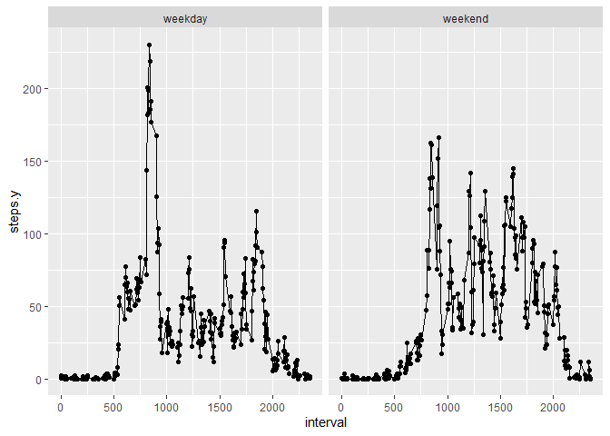

## Loading and preprocessing the data

First I load the data needed for this assignment

```r
unzip("activity.zip")
activity<-read.csv("activity.csv")
library(ggplot2)
```

```
## Warning: package 'ggplot2' was built under R version 4.0.2
```

## What is mean total number of steps taken per day?
The mean is 10766 and the median is 10765

```r
activity$date<-as.Date(activity$date)
total<-aggregate(steps~date,data = activity,sum)
hist<-hist(total$steps)
```

<!-- -->

```r
mean1<-mean(total$steps)
median<-median(total$steps)
```

## What is the average daily activity pattern?
Interval 835 has the highest average steps.

```r
interval<-aggregate(steps~interval,data = activity,mean)
plot(interval$interval,interval$steps,type = "l",xlab = "Interval",ylab = "Steps")
```

<!-- -->

```r
interval[which.max(interval$steps),]
```

```
##     interval    steps
## 104      835 206.1698
```
## Imputing missing values

There are 2304 missing values, I choose to fill the missing values with the average interval steps.

```r
Missing<-sum(is.na(activity$steps))
addMean<-merge(interval,activity,by.x = "interval",by.y = "interval")
filled<-addMean
count = 0
for (i in 1:nrow(filled)){
  if (is.na(filled[i,3])){
  filled[i,3]<-filled[i,2]
  count = count+1
  }}
FilledTotal<-aggregate(steps.y~date,data = filled,sum)
FilledHist<-hist(FilledTotal$steps.y)
```

<!-- -->

```r
meanperDay<-mean(FilledTotal$steps.y)
medianperDay<-median(FilledTotal$steps.y)
```


## Are there differences in activity patterns between weekdays and weekends?

Weekday activity has higher maximum value but most intervals has higher steps on weeked over weekdays

```r
weekday<- ifelse(weekdays(filled$date) %in% c("Saturday", "Sunday"), "weekend", "weekday")
weekday<-cbind(filled,weekday)
average<-aggregate(steps.y~interval+weekday,data = weekday,mean)
qplot(interval,steps.y,data=average,facets = ~weekday)+geom_line()
```

<!-- -->
